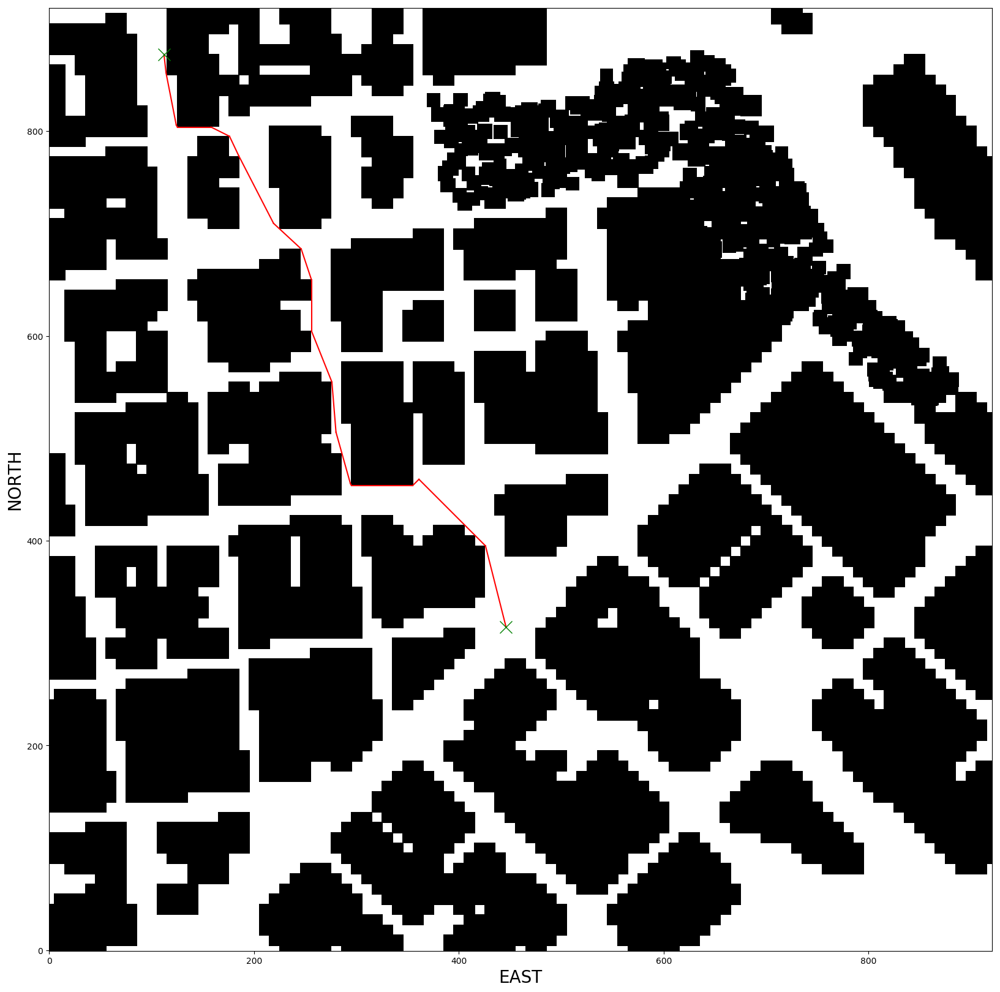
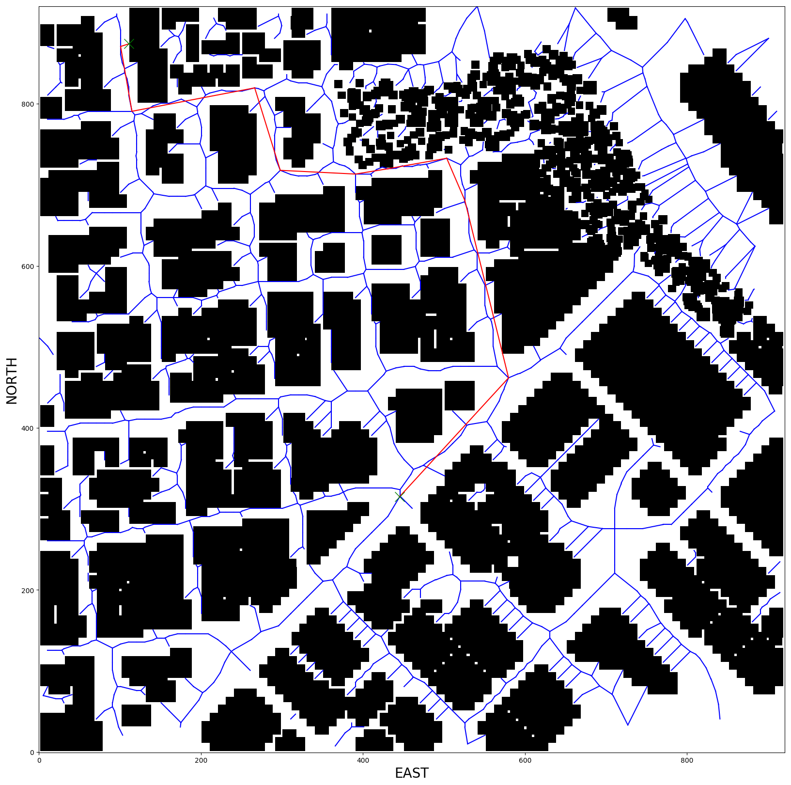

## Project: 3D Motion Planning


---


# Required Steps for a Passing Submission:
1. Load the 2.5D map in the colliders.csv file describing the environment.
2. Discretize the environment into a grid or graph representation.
3. Define the start and goal locations.
4. Perform a search using A* or other search algorithm.
5. Use a collinearity test or ray tracing method (like Bresenham) to remove unnecessary waypoints.
6. Return waypoints in local ECEF coordinates (format for `self.all_waypoints` is [N, E, altitude, heading], where the drone’s start location corresponds to [0, 0, 0, 0].
7. Write it up.
8. Congratulations!  Your Done!

## [Rubric](https://review.udacity.com/#!/rubrics/1534/view) Points
### Here I will consider the rubric points individually and describe how I addressed each point in my implementation.

---
### Writeup / README

#### 1. Provide a Writeup / README that includes all the rubric points and how you addressed each one.  You can submit your writeup as markdown or pdf.

You're reading it! Below I describe how I addressed each rubric point and where in my code each point is handled.

### Explain the Starter Code

#### 1. Explain the functionality of what's provided in `motion_planning.py` and `planning_utils.py`
These scripts contain a basic planning implementation that includes...

`motion_planning.py` - this script implements 3D motion planning using basic grid search. The script is run either with no runtime arguments, in which case it will command the drone to fly to an arbitray point, or with a goal location (as set from a valid location within the simulator i.e. not within an obstacle or other unreachable point), altitude for the drone to fly at, and safety distance for the drone to maintain around obstacles.

The functionality of the file is as follows:

**States class**

A class which contains the flight states that the drone can be set to adopt

**MotionPlanning class**

This is the main class of the program, which accepts the Drone class from the Udacidrone API as a parameter. The init function instantiates:
* The connection to the drone
* It's initial target position within the 3D grid
* Initial waypoints (set to none)
* Sets the `in_mission` flag to true to tell the drone it is now in a mission
* Defines an emtpy `check_state` dictionary
* Sets the initial flight state to *Manual*
* Registers callbacks which are used to monitor the drone's position, velocity and flight state

Within the MotionPlanning there are several functions which control the flow of the code in order to effectively control the drone during it's mission:

**local_position_callback**

This function handles the callback when the drone's local position is updated. The function checks which flight state the drone is in and directs the flow of the code to either the `waypoint_transition` (if the drone has taken off or is navigating between waypoints), or the `landing_transition` if the waypoint list is empty and the drone's local velocity is < 1.

**velocity_callback**

If the drone's flight state is *Landing*, the drone is within 0.1 of the *global_home* altitude and if the *local_position* altitude is < 0.01 i.e. the drone has landed at it's destination, then this function triggers the `disarming_transition`

**state_callback**

This function is triggered whenever the drone's flight state is updated. It controls the flow of the control of the drone from initially arming it, to path planning and takeoff (and ultimately waypoint navigation to a desired location), and finally to disarming the drone.

**arming_transition**

Sets the flight state to *Arming*, arms the drone and allows the program to take control of it

**takeoff_transition**

Sets the flight state to *Takeoff* and instructs the drone to takeoff to its target altitude

**waypoint_transition**

Sets the flight state to *Waypoint*, sets the drone's target position to the next waypoint in the waypoints list and commands the drone to fly to that waypoint

**landing_transition**

Sets the flight state to *Landing* and instructs the drone to land

**disarming_transition**

Sets the flight state to *Disarming*, disarms the drone and releases control of the drone by the script

**manual_transition**

Sets the flight state to *Manual*, stops the drone's motors and changes the `in_mission` flag to False to indicate that the drone's mission is complete

**send_waypoints**

Sends the list of waypoints to the simulation environment for visualisation

**plan_path**

This function initially: Sets the flight state to *Planning*; sets the target altitute to the altitude argument set at runtime, or 5m by default; sets the safety distance to maintain around objects to the --safety argument provided at runtime, or 5m by default; and sets the drone's target position altitude to the target altitude metioned previously.

Once these initial parameters are set motion planning can begin. Motion planning proceeds according to the following steps:
1. The global starting location is read in from the colliders.csv file as a latitude (lat), longitude (lon) coordinate pair
2. The drone's global home position is updated using the lat lon coordinates
3. The drone's local position (represented as NED coordinates) within the map of the environment is set using the `global_to_local` conversion function
4. Obstacle data is read from the colliders.csv file (this includes buildings, trees etc)
5. A grid representation of the environment is created by passing the obstacle data into the `create_grid` function. Offsets for adjusting from the drone's local position to the grid representation are also returned by the function
6. The drone's starting position on the grid (incorporation the offsets) is set with grid_start
7. The goal on the grid is set with grid_goal which either takes in goal_lat, goal_lon, goal_alt runtime arguments (converting them to a local position using the `global_to_local` function), or if they are not set, sets a goal 50m N by 50m E away from the local start position
8. A* search is used to find a path from the grid_start to the grid_goal
9. Bresenham ray tracing is used to prune the path in order to remove unecessary waypoints making the route more efficient
10. Finally the waypoints are sent to the drone and simulator

**start**

Starts the flight logs, creates a connection to the drone and stops the logs once the drone is disconnected

Note: Several of the drone commands such as landing, taking control, arming etc. are implemented in the Drone class by the Udacidrone API directly, so
they are not explained here but explanation can be found in the Udacidrone API documentation.

The `planning_utils.py` file contains several helper functions which facilitate the planning process. Briefly, these functions are:

**create_grid**

Returns a 2D representation of a 2D configuration space based on given obstable data, drone altitude and safety distance arguments

**Action class**

The action class represents the delta of the valid movement actions the drone can take relative to the current grid position, with an associated cost of performing the action. The class also has methods for reporting the cost of the action and the change in direction (delta in N / E / S / W)

**valid_actions**

Returns movements the drone can make given a grid and current node

**a_star**

A grid based implementation of A* search which returns a path from a given start point to a goal destination

**heuristic**

Calculates the Euclidean distance between a given point and the goal. The heuristic is used as an approximation to guide A* search and make it more efficient to return a path

**point**

Returns a 3D point as a numpy array

**collinearity_check**

Taken from the lesson exercises. Returns True if 3 points are collinear within the threshold set by Epsilon

**prune_path**

Prunes the path from the start point to the goal which was determined by A* search to remove unecessary waypoints using the `collinearty_check` function to determine if the points are in line

**bres_prune**

Uses Bresenham ray tracing instead of collinearity to prune the path of unecessary waypoints

## Alternate Implementation
I have also implemented a graph based planning method for the drone. These methods and utilities can be found in [motion_planning_graph.py](motion_planning_graph.py) and [planning_utils_graph.py](planning_utils_graph.py) respectively.

These files implement a Voronoi based graph which seeks to maximise the distance between obstacles when building the graph. In addition to the `create_graph` function which builds the graph and `closest_point` function to find the closest points on the graph to the drone's starting position and desired goal, modifications were made to: the A* path search to facilitate searching the graph.

## Results

Here are some samples of routes planned with both a grid represpentation of the environment and a graph (Voronoi) based representation. More routes found with both grid and graph based planning can be found in the [charts](charts/) folder.

**Example Plan: Navigating to a position in the top left corner of the map**

The coordinates of the goal (in the simulator) are: Lat = 37.797534 Lon = 122.401195

**Grid Based Plan**

Video of the drone executing the plan:

[](https://youtu.be/o9ExeDQneaQ "3D Motion Planning Grid")

Here is a chart of the pruned route based on a grid plan:


Here are some statistics from the grid plan:
* Original length of path: 675
* Pruned path length: 19
* Time to complete planning: 133.61 secs

**Graph Based Plan**

Video of the drone executing the plan:

[](https://youtu.be/v803syPlQRo "3D Motion Planning Graph")

Here is a chart of the pruned route based on a grid plan:


Here are some statistics from the grid plan:
* Original length of path: 109
* Pruned path length: 10
* Time to complete planning: 84.55 secs

**Summary**

For this goal location the graph plan returns a path to the goal in 63% of the time it took for the grid method. Although the pruned route of the graph plan had less waypoints (10 vs. 19), the drone actually took a longer path to the goal, mainly as a result of the graph maximising the distances between objects (we are also not required to return an optimal path for any methods here which is a much harder challenge to implement)

I have included several comparisons of grid and graph based plans to reach the same point which are included in the charts folder for reference and its interesting to see the differences in the routes found for each method. Its also worth noting that its often necessary to reduce the safety margin for the graph plan method to 3m instead of the default 5m so that a graph can be built which reaches most of the open locations on the map, otherwise there are some parts of the map that the drone won't be able to reach.


# Project Requirements

### Implementing Your Path Planning Algorithm

#### 1. Set your global home position
Here students should read the first line of the csv file, extract lat0 and lon0 as floating point values and use the self.set_home_position() method to set global home. Explain briefly how you accomplished this in your code.

I read the lat0, lon0 coordinates from the colliders file by opening the file with a handler, reading the first line of the file and passing it the variable row1, then extracted the lat and lon coordinates from the text of the row by using a regular expression to select only the numbers, decimal point and sign.

I then set the drone's global home position using the `set_home_position` method.

The relevant code snippet is below:

```
    # TODO: read lat0, lon0 from colliders into floating point values
    with open('colliders.csv', newline='') as f:
        reader = csv.reader(f)
        row1 = next(reader)
    f.close()

    lat = float(re.findall(
        "[-+]?[.]?[\d]+(?:,\d\d\d)*[\.]?\d*(?:[eE][-+]?\d+)?", row1[0])[1])
    lon = float(re.findall(
        "[-+]?[.]?[\d]+(?:,\d\d\d)*[\.]?\d*(?:[eE][-+]?\d+)?", row1[1])[1])

    # TODO: set home position to (lon0, lat0, 0)
    self.set_home_position(lon, lat, 0.0)
```

And here is a lovely picture of our downtown San Francisco environment from above!


#### 2. Set your current local position
Here as long as you successfully determine your local position relative to global home you'll be all set. Explain briefly how you accomplished this in your code.

I retrived the drone's current global position from the drone's `_longitude`, `_latitude`, `_altitude` properties and passed these variables as a list, along with the drone's `global_home` position property, to the `global_to_local` function which returns the drone's local position to the *local_position* variable.

Here is the relevant code snippet:
```
    # TODO: retrieve current global position
    global_position = [self._longitude, self._latitude, self._altitude]
    # TODO: convert to current local position using global_to_local()
    local_position = global_to_local(global_position, self.global_home)
```


#### 3. Set grid start position from local position
This is another step in adding flexibility to the start location. As long as it works you're good to go!

Working - Check!
```
    # TODO: convert start position to current position rather than map center
    grid_start = (int(np.ceil(local_position[0] - north_offset)),
                  int(np.ceil(local_position[1] - east_offset)))
```

#### 4. Set grid goal position from geodetic coords
This step is to add flexibility to the desired goal location. Should be able to choose any (lat, lon) within the map and have it rendered to a goal location on the grid.

Here I check to see if a goal location has been passed in at runtime. If so, I use `global_to_local` to convert the supplied lat, lon, alt to local coordinates and finally to a grid location. If no goal is passed as a runtime argument, then I set an arbitary goal location of +50 N, +50 E on the grid.

Here is the code:
```
        # TODO: adapt to set goal as latitude / longitude position and convert
        if args.goal_lon and args.goal_lat:
            if args.goal_alt:
                goal = [float(args.goal_lon), float(args.goal_lat), float(args.goal_alt)]
            else:
                goal = [float(args.goal_lon), float(args.goal_lat), 0.0]
            local_goal = global_to_local(goal, self.global_home)
            grid_goal = (int(np.ceil(local_goal[0] - north_offset)),
                         int(np.ceil(local_goal[1] - east_offset)))
        else:
            grid_goal = (-north_offset + 50, -east_offset + 50)
```

#### 5. Modify A* to include diagonal motion (or replace A* altogether)
Minimal requirement here is to modify the code in planning_utils() to update the A* implementation to include diagonal motions on the grid that have a cost of sqrt(2), but more creative solutions are welcome. Explain the code you used to accomplish this step.

Two steps were required to allow diagonal motion of the drone: 1) Adding the relevant deltas and cost of movement to the Action class and 2) Adding the required checks for each new movement to the `valid_actions` function to check if a move is allowable in a given grid position i.e. if the drone chooses one of the actions it will be classed as invalid if it would cause the drone to collide with an obstacle, or move out of the grid.

Here are the relevant sections of code:
1)
```
    NORTH_WEST = (-1, -1, np.sqrt(2))
    NORTH_EAST = (-1, 1, np.sqrt(2))
    SOUTH_WEST = (1, -1, np.sqrt(2))
    SOUTH_EAST = (1, 1, np.sqrt(2))
```
2)
```
    if (x - 1 < 0 or y - 1 < 0) or grid[x - 1, y - 1] == 1:
        valid_actions.remove(Action.NORTH_WEST)
    if (x - 1 < 0 or y + 1 > m) or grid[x - 1, y + 1] == 1:
        valid_actions.remove(Action.NORTH_EAST)
    if (x + 1 > n or y - 1 < 0) or grid[x + 1, y - 1] == 1:
        valid_actions.remove(Action.SOUTH_WEST)
    if (x + 1 > n or y + 1 > m) or grid[x + 1, y + 1] == 1:
        valid_actions.remove(Action.SOUTH_EAST)
```

#### 6. Cull waypoints
For this step you can use a collinearity test or ray tracing method like Bresenham. The idea is simply to prune your path of unnecessary waypoints. Explain the code you used to accomplish this step.

Initially I took the collinearity check code from the lesson and impletemented here to prue the path. As mentioned above the code checks for collinearity between 3 points and removes the middle point if the condition is met.

The relevant code for this is here:
```
def collinearity_check(p1, p2, p3, epsilon=1e-6):
    m = np.concatenate((p1, p2, p3), 0)
    det = np.linalg.det(m)
    return np.abs(det) < epsilon

def prune_path(path):
    if path is not None:
        pruned_path = [p for p in path]
        # TODO: prune the path!
        i = 0
        while i < len(pruned_path) - 2:
            p1 = point(pruned_path[i])
            p2 = point(pruned_path[i + 1])
            p3 = point(pruned_path[i + 2])

            # If the 3 points are in a line remove
            # the 2nd point.
            # The 3rd point now becomes and 2nd point
            # and the check is redone with a new third point
            # on the next iteration.
            if collinearity_check(p1, p2, p3):
                # Something subtle here but we can mutate
                # `pruned_path` freely because the length
                # of the list is check on every iteration.
                pruned_path.remove(pruned_path[i + 1])
            else:
                i += 1

        return pruned_path
```
Whilst this code did prune points occaisonally, I found that it did not drastically reduce the number of waypoints the drone had to navigate, even on seemingly straight paths from point to point.

After checking the discussion by students on Slack, I was able to leverage code provided by Mike Hahn (Thanks Mike!) to implement the Bresenham ray tracing pruning method, which prunes the path much more aggressively than the collinearity method in the experiments I performed. (This could potentially be due to my implementation of the collinearity check however)

Here is the code for Bresenham ray tracing pruning:
```
def bres_prune(grid, path):
    """
    Use the Bresenham module to trim uneeded waypoints from path
    """
    pruned_path = [p for p in path]
    i = 0
    while i < len(pruned_path) - 2:
        p1 = pruned_path[i]
        p2 = pruned_path[i + 1]
        p3 = pruned_path[i + 2]
        # if the line between p1 and p2 doesn't hit an obstacle
        # remove the 2nd point.
        # The 3rd point now becomes the 2nd point
        # and the check is redone with a new third point
        # on the next iteration.
        if  all((grid[pp] == 0) for pp in bresenham(int(p1[0]), int(p1[1]), int(p3[0]), int(p3[1]))):
            # Something subtle here but we can mutate
            # `pruned_path` freely because the length
            # of the list is checked on every iteration.
            pruned_path.remove(p2)

        else:
            i += 1
    return pruned_path
```

### Execute the flight
#### 1. Does it work?
It works!

### Double check that you've met specifications for each of the [rubric](https://review.udacity.com/#!/rubrics/1534/view) points.

# Extra Challenges: Real World Planning

For an extra challenge, consider implementing some of the techniques described in the "Real World Planning" lesson. You could try implementing a vehicle model to take dynamic constraints into account, or implement a replanning method to invoke if you get off course or encounter unexpected obstacles.

# TODO
* Implement a 2.5D or 3D plan and allow 3D motion of the drone
* Implement obstacle avoidance via coarse + local planning methods
* Implement re-planning to handle cases where the drone deviates off-course
